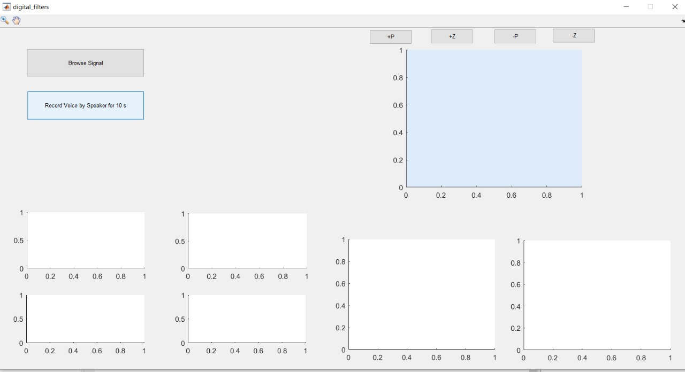

# DSP

## All work credit to Asmaa Mourad, Laila Abbas and Moaz khairy

## Task 1

#### Choose Digital filter parameters and apply it on digital signal by MATLAB

## Task 2

#### Creat Gui with buttons that apply different filters to the same signal and get different output voices
#### by MATLAB and Python

## Task 3

#### Create MATLAB GUI which choose digital Biomedical signal
#### Get signal from stored one or recorded voice
#### Choose poles from choosing points on the unit circle
#### Choose zeros and get required filter transfer function from the chosen poles and zeros
#### At the end, Plot filter frequency response both magnitude and phase
#### and Plot filtered signal in time and frequency (magnitude) domains

## Task 4

#### Sound Equalizer

#### 8 Band Equalizer for voice filteration
#### using stored signal and apply offline filteration 
#### or life sound and apply online filteration
#### Plot both input and output signals in time domain
#### and their magnitude and phase in frequency domain

## Task 5

#### Take actual EMG measurement 
#### caculate signal features like mean

## Task 6

#### Use EEG sensor to get signals of different hand movements
#### Create classifier to differentiate between those movements 